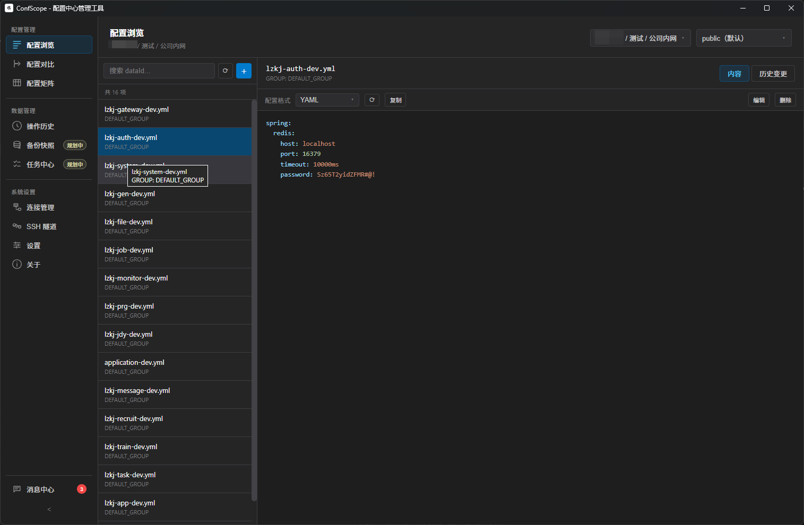
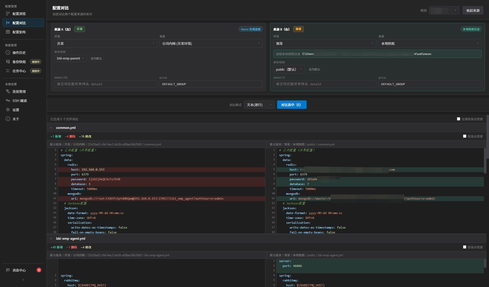
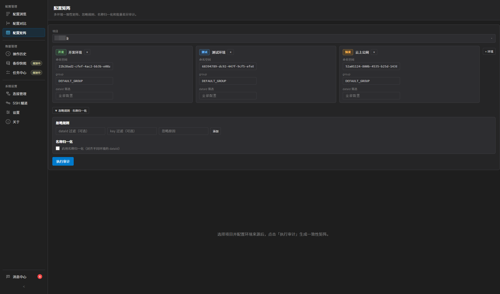

<p align="center">
  
</p>

<h1 align="center">ConfScope</h1>

<p align="center">
  <strong>多配置中心统一管理 · 智能对比 · 安全变更 · 治理洞察</strong>
</p>

ConfScope 是一个基于 **Wails 2 + Go + React + TypeScript** 的桌面配置中心管理工具。当前已支持 Nacos、Apollo、Consul 和本地快照来源，覆盖配置浏览、对比、审计、备份恢复、安全变更计划和真实环境冒烟测试。

## 支持的配置中心

| 配置中心 | 状态 | 当前能力 |
| --- | --- | --- |
| Nacos | 已支持 | v1/v3 自适配，自建 Nacos + 阿里云 MSE；支持浏览、历史、Diff、审计、安全写入、删除、ApplyPlan |
| Apollo | 已支持 | OpenAPI 适配；支持连接测试、浏览、Diff、审计、导出；通过 ApplyPlan 受控写入 properties namespace 并 release |
| Consul | 已支持 | KV 适配；支持连接测试、浏览、Diff、审计、导出；通过 ApplyPlan 受控创建、更新、删除文本 KV，并使用 ModifyIndex/CAS 防护 |
| 本地快照 | 已支持 | 本地目录只读 provider，可参与浏览、Diff、审计、回滚来源 |
| WebDAV 快照 | 已支持 | 配置快照 `.cssnapshot` 上传、远端列表、导入、Diff |

> Nacos / Apollo / Consul 的写入都必须经过 ApplyPlan、dry-run、before backup 和生产确认。直接 publish/delete 绑定会被阻断；本地快照始终只读。

## 界面预览

### 配置浏览

<p align="center">
  
</p>

### 配置对比

<p align="center">
  
</p>

### 配置矩阵

<p align="center">
  
</p>

## 核心特性

| 模块 | 说明 |
| --- | --- |
| 连接与来源管理 | 按项目、环境、来源管理多套配置中心连接；支持 Nacos/Apollo/Consul/local snapshot |
| 配置浏览 | 命名空间、Apollo App/Cluster/Namespace、Consul KV prefix、本地快照统一浏览 |
| 历史与 Diff | Nacos 历史版本查看；支持历史对比、线上对比、跨来源对比和本地快照对比 |
| 配置矩阵审计 | 多环境/多来源审计，支持忽略规则、差异定位、脱敏导出 |
| 安全变更计划 | ApplyPlan dry-run、before backup、生产目标确认、沙箱验证、推广和回滚链路 |
| 备份恢复 | 应用数据 `.csbackup` 本地/WebDAV 备份恢复；配置快照 `.cssnapshot` 本地/WebDAV 同步 |
| SSH 隧道 | 支持可复用 SSH profile，覆盖 SSH 连接测试和 Nacos over SSH |
| 凭据安全 | Windows 下支持小凭据迁移到系统凭据库，localStorage 保存 `secretRef`；`.csbackup` 仍保留跨机器迁移能力 |
| 真实环境测试 | Docker Nacos/Apollo fixture/Consul/WebDAV/SSH + Windows native Wails smoke 覆盖主流程 |

## 安全与备份边界

- `.csbackup` 是迁移电脑的主路径：备份包加密，恢复时写回可用的本地数据。
- Windows 小凭据迁移覆盖 Nacos password/token、Aliyun MSE AK/SK、Apollo token、Consul token、WebDAV password。
- SSH private key、SSH passphrase 等大 secret 暂未迁移到安全存储，已拆成后续 `windows-large-secret-protection` 任务线。
- `.csbackup` / `.cssnapshot` 包密码是一次性输入，不会持久化。
- macOS Keychain / Linux Secret Service 尚未实现；非 Windows 平台仍走兼容回退。

## 技术栈

- Wails 2 + Go
- React 18 + TypeScript + Vite 5
- Go 后端直连配置中心 OpenAPI / HTTP API
- localStorage 本地持久化，配合加密备份包和 Windows Credential Manager
- Playwright + Vitest + Go test + Docker smoke

## 快速开始

### 环境要求

- Node.js >= 18
- pnpm >= 8
- Go >= 1.22
- Wails CLI v2
- Docker（运行 smoke 测试时需要）

### 安装

```bash
git clone https://github.com/Adsryen/ConfScope.git
cd ConfScope

pnpm install
go install github.com/wailsapp/wails/v2/cmd/wails@latest
wails doctor
```

### 开发

```bash
pnpm dev        # 启动 Wails 桌面应用
pnpm dev:web    # 仅启动前端，适合 UI 调试
```

### 构建

```bash
pnpm build      # 打包当前系统桌面应用
pnpm build:win  # Windows 下打包 NSIS 安装包
```

### 发布产物（GitHub Actions）

推送 `v*` tag 后，Release workflow 会构建并上传：

| 平台 | 产物 |
| --- | --- |
| Windows amd64 | `ConfScope.exe` |
| Linux amd64 | `confscope-linux-amd64.tar.gz` / `.deb` / `.rpm` |
| macOS arm64 | `ConfScope-darwin-arm64.dmg` |
| macOS amd64 | `ConfScope-darwin-amd64.dmg` |

也可在 Actions 中用 **workflow_dispatch** 手动试跑构建（只上传 artifact，不创建正式 Release）。

> macOS DMG 当前未做 Apple 代码签名与公证。首次打开若被 Gatekeeper 拦截，可在 Finder 中对应用「右键 → 打开」确认一次。

### 测试

```bash
go test ./... -count=1
pnpm exec tsc --noEmit
pnpm test
pnpm build:web
pnpm test:smoke
pnpm test:smoke:native
```

## 项目结构

```text
ConfScope/
├── app.go / app_*.go              # Wails 绑定与应用服务
├── internal/                      # Go 后端模块
│   ├── nacos/                     # Nacos API
│   ├── apollo/                    # Apollo OpenAPI
│   ├── consul/                    # Consul KV API
│   ├── appbackup/                 # .csbackup 加密备份与 WebDAV
│   ├── snapshotwebdav/            # .cssnapshot WebDAV 同步
│   ├── securestore/               # Windows Credential Manager 封装
│   └── ssh/                       # SSH 连接与隧道
├── src/
│   ├── api/                       # 前端 Wails API wrapper
│   ├── components/                # React 页面与组件
│   ├── lib/                       # Diff、ApplyPlan、备份、凭据迁移等领域逻辑
│   ├── store/                     # localStorage store
│   └── locales/                   # 中英文文案
├── tests/
│   ├── compat/                    # 数据迁移兼容护栏
│   └── smoke/                     # Docker + Playwright 真实环境冒烟
├── wailsjs/                       # Wails 生成的前端绑定
└── docs/todo/                     # 路线图与阶段计划
```

## 当前路线图

已完成：

- Nacos v1/v3 支持、配置浏览、历史、Diff、审计
- Apollo OpenAPI 浏览、审计和 ApplyPlan properties 写入
- Consul KV 浏览、审计和 ApplyPlan CAS 写入
- 本地快照 provider 与本地数据迁移护栏
- ApplyPlan 安全写入、沙箱验证、推广、回滚
- 应用数据本地/WebDAV 备份恢复
- 配置快照 WebDAV 同步
- Windows 小凭据 `secretRef` 真实迁移
- 容器化全量 smoke 与 Windows native Wails smoke

后续规划：

- Windows 大 secret 保护：SSH privateKey/passphrase/password 的 DPAPI 文件方案
- v2 平台化数据模型：项目、环境、provider、source 抽象
- 多 provider 聚合浏览视图
- 跨 provider 治理矩阵
- 平台安全模型
- 跨 provider Apply 策略
- 治理报告

详细路线见 [platform-governance-roadmap.md](docs/todo/platform-governance-roadmap.md)。

## 致谢与说明

本项目基于 [Configuration-Center-Browser](https://github.com/iGuos/Configuration-Center-Browser) 的设计思路进行二次开发。原项目提供了 Nacos 配置管理的核心理念和前端交互设计，在此向原作者 [iGuos](https://github.com/iGuos) 表示感谢。

主要改进：

- 后端从纯前端请求重构为 Go + Wails 2 架构。
- 前端扩展为桌面端多页面工作台，覆盖浏览、Diff、审计、备份、任务、设置和 SSH。
- 配置中心从 Nacos 扩展到 Apollo、Consul 和本地快照。
- 引入 ApplyPlan、安全备份、真实环境 smoke 和 Windows 凭据库迁移。

也感谢 [Linux Do](https://linux.do) 佬友开发社区。

## 贡献

欢迎提交 Issue 和 Pull Request。

## 许可证

AGPL-3.0-only

---

<p align="center">
  <br/>
  <strong>ConfScope</strong> — <em>多配置中心统一管理 · 智能对比 · 安全变更 · 治理洞察</em>
</p>
